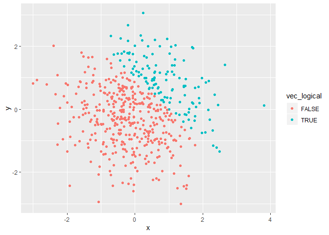
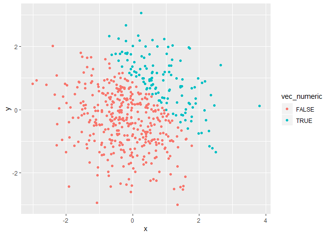
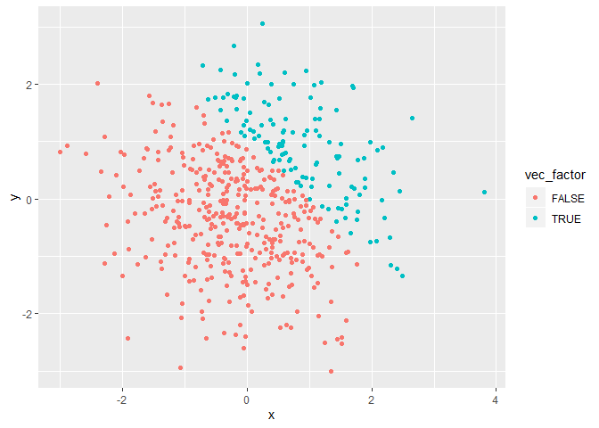

Homework 1
================
Rachel Lee
9/20/2019

``` r
library(tidyverse)
```

    ## -- Attaching packages -------------------------------------------------------------------------------- tidyverse 1.2.1 --

    ## v ggplot2 3.2.1     v purrr   0.3.2
    ## v tibble  2.1.3     v dplyr   0.8.3
    ## v tidyr   0.8.3     v stringr 1.4.0
    ## v readr   1.3.1     v forcats 0.4.0

    ## -- Conflicts ----------------------------------------------------------------------------------- tidyverse_conflicts() --
    ## x dplyr::filter() masks stats::filter()
    ## x dplyr::lag()    masks stats::lag()

# Problem 1

## create dataframe

``` r
# Creating dataframe
set.seed(10)
problem1_df= tibble(
  random = rnorm(8),
  vec_logical = random > 0,
  vec_char = c("a", "c", "f", "g", "k", "i", "p", "h"),
  vec_factor = as.factor(c("m","f","o","m","m","f","o","f"))
)
#we got a numeric value 
mean(problem1_df$random) 
```

    ## [1] -0.3779272

``` r
#we got a numeric value 
mean(problem1_df$vec_logical)
```

    ## [1] 0.375

``` r
#we did not get a numeric value because it is a character vector
mean(problem1_df$vec_char)
```

    ## Warning in mean.default(problem1_df$vec_char): argument is not numeric or
    ## logical: returning NA

    ## [1] NA

``` r
#we did not get a numeric value because it is a non-numeric factor vector
mean(problem1_df$vec_factor)
```

    ## Warning in mean.default(problem1_df$vec_factor): argument is not numeric or
    ## logical: returning NA

    ## [1] NA

``` r
#coercing character vector as numeric vector, we do not get a mean
mean(as.numeric(problem1_df$vec_char))
```

    ## Warning in mean(as.numeric(problem1_df$vec_char)): NAs introduced by
    ## coercion

    ## [1] NA

``` r
#coercing factor vector as numeric vector, we get a mean 
mean(as.numeric(problem1_df$vec_factor))
```

    ## [1] 1.875

\#creating the second code chunk: multiplying variables

``` r
# Problem_1part2

# Coerce logical vector as numeric, then multiply with random variables
as.numeric(problem1_df$vec_logical)*(problem1_df$random)
```

    ## [1] 0.01874617 0.00000000 0.00000000 0.00000000 0.29454513 0.38979430
    ## [7] 0.00000000 0.00000000

``` r
# Coerce logical vector as factor, then multiply with random variables
as.factor(problem1_df$vec_logical)*(problem1_df$random)
```

    ## [1] NA NA NA NA NA NA NA NA

``` r
# Coerce logical vector as a factor vector, then coerce it as a numeric vector, then multiply with random variables
as.numeric(as.factor(problem1_df$vec_logical))*(problem1_df$random)
```

    ## [1]  0.03749234 -0.18425254 -1.37133055 -0.59916772  0.58909025  0.77958860
    ## [7] -1.20807618 -0.36367602

# Problem 2

## Creating ggplots

### Creating a new dataframe

``` r
# Creating dataframe
set.seed(1)
problem2_df = tibble(
  x = rnorm(500),
  y = rnorm(500),
  vec_logical = c(x + y > 1),
  vec_numeric = c(vec_logical),
  vec_factor = c(vec_logical)
)
```

### A short description of the dataframe

  - The number of rows in the dataframe is **500**.
  - The number of columns in the dataframe is **5**.
  - The mean, median, and standard deviation of *x* are **0.0226441,
    -0.0367783 and 1.0119283** respectively
  - The proportion of cases for which the logical vector(x + y \> 1) is
    true: **0.252**.

### Use the dataframe **problem2\_df** and create scatter plots

``` r
# Create a scatter plot of the logical vector
ggplot(problem2_df, aes(x = x, y = y, color = vec_logical)) + geom_point()
```

<!-- -->

``` r
# Save the ggplot as a PNG file
ggsave(filename = "C:/Users/shvar/OneDrive/Desktop/problem2_df_color_logical_ggplot.png")
```

    ## Saving 7 x 5 in image

``` r
# Creating a scatter plot using the numeric vector
ggplot(problem2_df, aes(x = x, y = y, color = vec_numeric)) + geom_point()
```

<!-- -->

``` r
# Creating a scatter plot using the factor vector
ggplot(problem2_df, aes(x = x, y = y, color = vec_factor)) + geom_point()
```

<!-- -->
